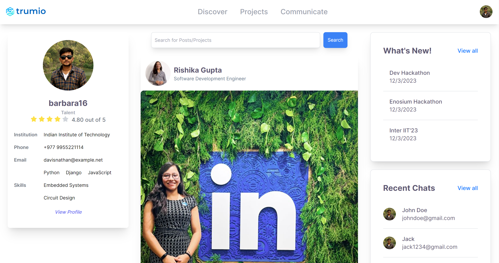
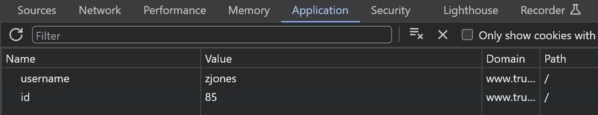
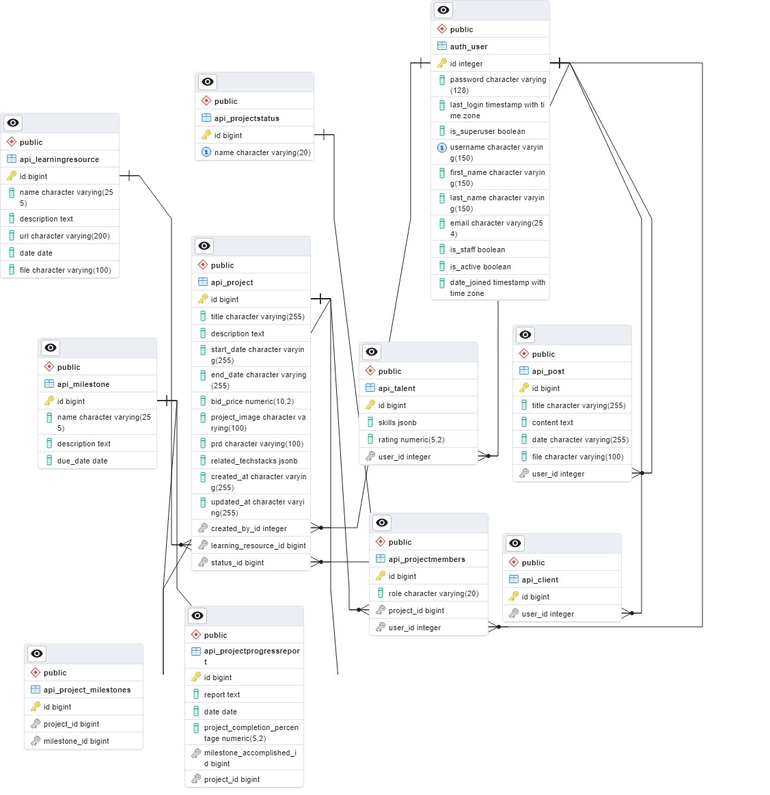

<a name="readme-top"></a>

<h1 align="center">
	
</h1>

<h3 align="center">
	TruConnect - Standalone Application developed to enhance Trumio 
</h3>

<p align="center">
	<strong>
		<a href="http://www.trumio.site/">Front-End</a>
		•
		<a href="http://103.159.214.229/redoc">Back-End</a>
	</strong>
</p>

Welcome to the UPEC trumio standalone application. This application is a transformative community engagement platform that serves as a centralized hub for students to connect with industry professionals and alumni to deepen their ties with their alma mater. Our platform leverages AI to personalize recommendations, offer real-time support, and facilitate seamless collaboration, fostering a thriving ecosystem where individuals can flourish all while following Trumio’s objectives and Business goals.

<div style="display: inline-block; background-color: black; padding: 2px; box-shadow: 0 0 10px rgba(0, 0, 0, 0.5);">
    <!-- Inline styles for the image -->
    
  </div>
<!-- TABLE OF CONTENTS -->
<details>
  <summary>Table of Contents</summary>
  <ol>
    <li>
      <a href="#about-the-project">About The Project</a>
      <ul>
        <li><a href="#built-with">Built With</a></li>
      </ul>
    </li>
    <li>
      <a href="#getting-started">Getting Started</a>
      <ul>
        <li><a href="#prerequisites">Prerequisites</a></li>
        <li><a href="#installation">Installation</a></li>
      </ul>
    </li>
    <li><a href="#backend-folder-structure">Backend Folder Structure</a></li>
    <li><a href="#frontend-folder-stucture">Frontend Folder Structure</a></li>
    <li><a href="#roadmap">Roadmap</a></li>
    <li><a href="#contact">Contact</a></li>
  </ol>
</details>

## About the Project

### Design

Explore our design on Figma: [Figma Design](https://www.figma.com/file/KdD8rGWX5qQkKUOjqRGO8y/UPEC?type=design&mode=design&t=9e5YHN0OZl7OPpB9-1)

This project is a standalone application that can be integrated to trumio's platform that will drive greater alumini engagement, upskill students on the latest technologies and ensure that students dilever projects that meet the clients expectation.

1. The Community Feed section serves as a dynamic catalyst within the engagement platform, strategically designed to enhance alumni engagement and streamline the inflow of client projects to students and universities.
2. Students will get project recommendations based on their skills and interests.
3. Clients can generate a product requirement document by just filling in the description of the project and the tech stacks required. This will be automatically generated by our AI model as and when the client clicks ont the PRD generate button. The PRD will include the project overview, original requirements, project goals, user stories, system architecture, tech stacks, requirement pool, ui/ux design, development methodology, security measures, testing strategy, scalability and performance, deployment plan, maintenance and support, risks and mitigations, compliance and regulations, budget and resources, timeline and milestones, communication plan and anything unclear. This will save a lot of time for the client and will drive greater engagement.
4. Students upon accepting a project can automatically generate a project workflow that will help them plan their project. The AI tool will also help them divide task among the team members based on their skills and interests. This will compensate the need of a project manager and will help the students to deliver projects that meet the client's expectations.
5. Students can leverage the AI tool to generate the learning resources needed for a particular project and also on a personal level. This will help them to upskill themselves and will help the students in their overall growth and development in the platform.
6. There is a Trumio Copilot that will help the students and clients to get real time support and will help them to resolve their queries be it project related or general queries. This will help both the students and clients to get real time support and will help them to resolve their queries in a timely manner, driving greater engagement.
7. The platform has also included a rating based feature to gamify the complete process. This will make the students more competitive and will help them to deliver projects that meet the client's expectations. This will also help the clients to get the best out of the students and will help them to get projects that meet their expectations.

<p align="right">(<a href="#readme-top">back to top</a>)</p>

### Built With

- [![Next][Next.js]][Next-url]
- [![DjangoREST][DjangoREST]][DjangoREST-url]
- [![TailwindCSS][TailwindCSS]][TailwindCSS-url]
- [![MongoDB][MongoDB]][MongoDB-url]
- [![socket.io][socket.io]][socket.io-url]
- [![python][python]][python-url]
- [![Docker][Docker]][Docker-url]
- [![Gunicorn][Gunicorn]][Gunicorn-url]

<p align="right">(<a href="#readme-top">back to top</a>)</p>

<!-- GETTING STARTED -->

## Getting Started

Follow these instructions to set up and run the project locally on your machine.

### Prerequisites

Before you begin, ensure you have the following installed:

- Python 3.10 +

### Installation

1. Clone the repository:

   ```bash
   git clone https://github.com/trumio-interiit/team_22.git
   ```

2. Navigate to the project directory:

   ```bash
   cd team_22
   ```

3. Create a virtual environment (optional but recommended -- Step 4-5):

   ```bash
   python -m venv venv
   ```

4. Activate the virtual environment:

   - On Windows:

     ```bash
     venv\Scripts\activate
     ```

   - On Unix or MacOS:

     ```bash
     source venv/bin/activate
     ```

#### Backend

5. Navigate to the backend directory:

   ```bash
   cd server
   ```

6. Install the project dependencies:

   ```bash
   pip install -r requirements.txt
   ```

7. Run database migrations:

   ```bash
   python manage.py migrate
   ```

8. Run the development server:

   ```bash
   python manage.py runserver
   ```

#### Frontend

9. Navigate to the frontend directory:

   ```bash
   cd client
   ```

10. Install the project dependencies:

    ```bash
    npm install
    ```

11. Run the development server:

    ```bash
    npm run dev
    ```

12. Login With a Cookie:

    ```bash
    open chromes developer tools and navigate to application -> add 2 Cookies
    Cookie 1 : {id:<your_preferred_user_id>}
    Cookie 2 : {username:<users_name>}
    id = 155 , username = barbara16 -> Talent Login
    id = 85 , username = zjones -> Client Login
    ```

    <div style="display: inline-block; background-color: black; padding: 2px; box-shadow: 0 0 10px rgba(0, 0, 0, 0.5);">
    <!-- Inline styles for the image -->
    
    </div>

# Database

13. Create a database named "trumio" in MongoDB and import the database dump file from the database directory.

    ```bash
    python manage.py loaddata data.json
    ```

14. Below is our ER diagram which you can have a look onto for a top level overview of our database
<div style="display: inline-block; background-color: black; padding: 2px; box-shadow: 0 0 10px rgba(0, 0, 0, 0.5);">
    <!-- Inline styles for the image -->
    
</div>

<p align="right">(<a href="#readme-top">back to top</a>)</p>

## Backend Folder Structure

```
- server/
    ├── api/
    ├── server/
    ├── .gitignore
    ├── data.json
    ├── db.json
    ├── db.sqlite3
    ├── docker-compose.yaml
    ├── dockerfile
    ├── manage.py
    ├── output.docx
    └── requirements.txt
```

For the api folder:

```
└── api/ <br>
    ├── fake_data
    ├── llm/
    │   ├── data_embeddings.py
    │   ├── data_embeddings_community.py
    │   ├── learning_resource.py
    │   ├── management.py
    │   ├── message_handler.py
    │   ├── prd_generator.py
    │   ├── project_recommendation.py
    │   ├── student_skills.py
    │   └── workflow.py
    ├── management/commands
    ├── migrations
    ├── models/
    │   ├── chat.py
    │   ├── community.py
    │   ├── projects.py
    │   └── user.py
    ├── utils/
    │   ├── initiate_pinecone.py
    │   └── load_embedding_model.py
    ├── views/
    │   ├── get_data_views.py
    │   ├── llm_views.py
    │   └── messaging_views.py
    ├── admin.py
    ├── apps.py
    ├── consumers.py
    ├── helpers.py
    ├── routing.py
    ├── serializers.py
    ├── signals.py
    ├── tests.py
    └── urls.py
```

## Frontend Folder Stucture

```
└── client/
    ├── public
    ├── src/
    │   ├── app/
    │   │   ├── accounts/
    │   │   │   ├── error.jsx
    │   │   │   ├── loading.jsx
    │   │   │   └── page.jsx
    │   │   ├── communicate/
    │   │   │   ├── error.jsx
    │   │   │   ├── loading.jsx
    │   │   │   └── page.jsx
    │   │   ├── profile/
    │   │   │   ├── error.jsx
    │   │   │   ├── loading.jsx
    │   │   │   └── page.jsx
    │   │   ├── projects/
    │   │   │   ├── [id]
    │   │   │   ├── error.jsx
    │   │   │   ├── loading.jsx
    │   │   │   └── page.jsx
    │   │   ├── data.json
    │   │   ├── error.jsx
    │   │   ├── favicon.ico
    │   │   ├── globals.css
    │   │   ├── layout.jsx
    │   │   ├── loading.jsx
    │   │   └── page.jsx
    │   ├── components/
    │   │   ├── CommunicatePageComponents/
    │   │   │   ├── MainChatCard.js
    │   │   │   ├── RecentChats.js
    │   │   │   ├── RecieverChatCard.js
    │   │   │   └── SenderChatCard.js
    │   │   ├── HomePageComponents/
    │   │   │   ├── PostCard.js
    │   │   │   ├── ProfileCard.js
    │   │   │   ├── RecentEvents.js
    │   │   │   └── recentChatCard.js
    │   │   ├── NavbarComponent/
    │   │   │   └── NavbarComponent.js
    │   │   ├── ProfilePageComponents/
    │   │   │   ├── ProfileCard.js
    │   │   │   ├── ProfileDescriptionCard.js
    │   │   │   ├── SkillsCard.js
    │   │   │   └── SocialCard.js
    │   │   ├── ProjectPageComponents/
    │   │   │   ├── EachProjectCard.js
    │   │   │   ├── PRDCard.js
    │   │   │   ├── ProjectCard.js
    │   │   │   ├── WorkflowCard.js
    │   │   │   └── sampleData.json
    │   │   ├── ClipLoader.js
    │   │   └── Loader.js
    │   └── context/
    │       └── HomeContext.js
    ├── .gitignore
    ├── README.md
    ├── jsconfig.json
    ├── next-sitemap.config.js
    ├── next.config.js
    ├── package-lock.json
    ├── package.json
    ├── postcss.config.js
    └── tailwind.config.js
```

<!-- ROADMAP -->

## Roadmap

- [x] Create a intuitive UI/UX design for the platform.
- [x] Create a Product Requirement Document generator AI tool.
- [x] Create a project workflow generator AI tool.
- [x] Create a learning resource generator AI tool.
- [x] Create a Trumio Copilot.
- [x] Create a intra University Alumini student engagement chat groups with Trumio Copilot.

<p align="right">(<a href="#readme-top">back to top</a>)</p>

<!-- CONTACT -->

## Contact

Project Link:

<p align="right">(<a href="#readme-top">back to top</a>)</p>

[Next.js]: https://img.shields.io/badge/next.js-000000?style=for-the-badge&logo=nextdotjs&logoColor=white
[Next-url]: https://nextjs.org/
[DjangoREST]: https://img.shields.io/badge/DJANGO-REST-ff1709?style=for-the-badge&logo=django&logoColor=white&color=ff1709&labelColor=gray
[DjangoREST-url]: https://www.django-rest-framework.org/
[TailwindCSS]: https://img.shields.io/badge/tailwindcss-38B2AC?style=for-the-badge&logo=tailwind-css&logoColor=white
[TailwindCSS-url]: https://tailwindcss.com/
[MongoDB]: https://img.shields.io/badge/MongoDB-4EA94B?style=for-the-badge&logo=mongodb&logoColor=white
[MongoDB-url]: https://www.mongodb.com/
[socket.io]: https://img.shields.io/badge/socket.io-010101?style=for-the-badge&logo=socket.io&logoColor=white
[socket.io-url]: https://socket.io/
[WebRTC]: https://img.shields.io/badge/WebRTC-333333?style=for-the-badge&logo=webrtc&logoColor=white
[WebRTC-url]: https://webrtc.org/
[python]: https://img.shields.io/badge/python-3776AB?style=for-the-badge&logo=python&logoColor=white
[python-url]: https://www.python.org/
[Docker]: https://img.shields.io/badge/docker-2496ED?style=for-the-badge&logo=docker&logoColor=white
[Docker-url]: https://www.docker.com/
[Gunicorn]: https://img.shields.io/badge/gunicorn-37474F?style=for-the-badge&logo=gunicorn&logoColor=white
[Gunicorn-url]: https://gunicorn.org/
